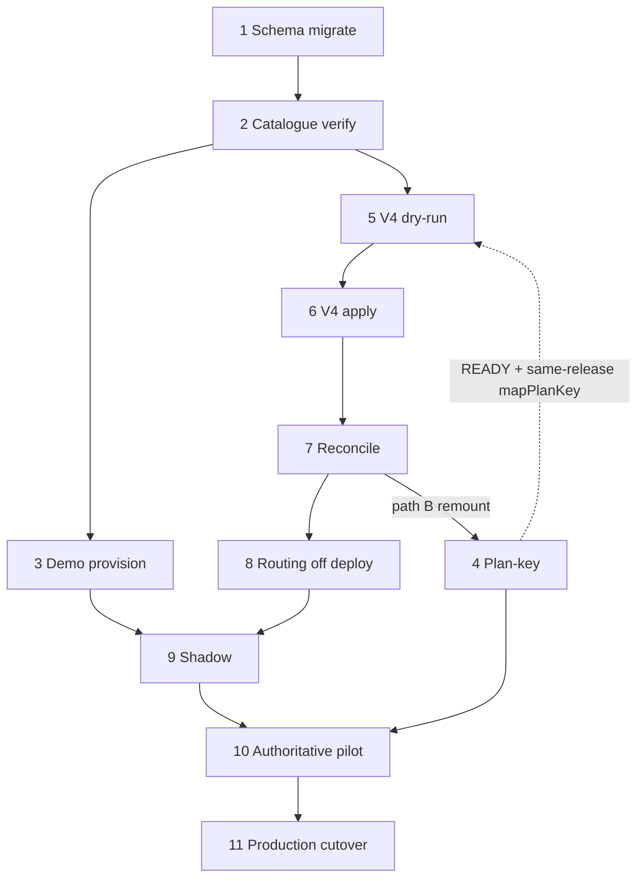

# V5 combined migration order runbook

**Date:** 2026-07-19  
**Mode:** Sequencing documentation only — **do not execute** migrations, routing flips, or hosted writes from this file  
**Purpose:** Single ordered view of V5 schema, catalogue, plan-key, demo, V4→V5, reconciliation, shadow, authoritative pilot, and production cutover  

**Authority sources (do not invent beyond these):**

| Area | Sources |
|------|---------|
| V5 schema / identity | [`HOSTED_SUPABASE_RUNBOOK.md`](../database/HOSTED_SUPABASE_RUNBOOK.md), `npm run db:migrate` / `db:bootstrap:foundation` / `db:identity:check` / `db:verify:foundation` |
| V4→V5 | [`V5_HOSTED_MIGRATION_AND_CUTOVER.md`](../database/V5_HOSTED_MIGRATION_AND_CUTOVER.md), [`V4_TO_V5_HOSTED_DRY_RUN_CHECKLIST.md`](./V4_TO_V5_HOSTED_DRY_RUN_CHECKLIST.md), [`V4_TO_V5_RECONCILIATION_TEMPLATE.md`](./V4_TO_V5_RECONCILIATION_TEMPLATE.md), [`V4_TO_V5_ROLLBACK_REHEARSAL.md`](./V4_TO_V5_ROLLBACK_REHEARSAL.md), [`V4_SOURCE_COMPATIBILITY_AUDIT.md`](./V4_SOURCE_COMPATIBILITY_AUDIT.md) |
| Plan-key | [`BLESSBOARD_PLAN_KEY_MIGRATION_PLAN.md`](./BLESSBOARD_PLAN_KEY_MIGRATION_PLAN.md), [`BLESSBOARD_PLAN_KEY_LOCAL_REHEARSAL.md`](./BLESSBOARD_PLAN_KEY_LOCAL_REHEARSAL.md) |
| Demo | [`V5_DEMO_DATASET_TOOL.md`](../testing/V5_DEMO_DATASET_TOOL.md), [`V5_DEMO_TENANT_REMEDIATION_PLAN.md`](../testing/V5_DEMO_TENANT_REMEDIATION_PLAN.md), [`V5_DEMO_PROVISIONING_COMMAND_AUDIT.md`](../testing/V5_DEMO_PROVISIONING_COMMAND_AUDIT.md) |
| Routing | [`V5_SHADOW_ROUTING_READINESS.md`](../deployment/V5_SHADOW_ROUTING_READINESS.md), [`V5_SHADOW_MODE_RUNBOOK.md`](../deployment/V5_SHADOW_MODE_RUNBOOK.md), [`V5_AUTHORITATIVE_ROUTING_PREREQUISITES.md`](../deployment/V5_AUTHORITATIVE_ROUTING_PREREQUISITES.md) |
| Entitlements / packages | [`FOUNDATION_GROWTH_ENTITLEMENT_RECONCILIATION.md`](../product/FOUNDATION_GROWTH_ENTITLEMENT_RECONCILIATION.md), [`NETWORK_ENTITLEMENT_MATRIX.md`](../product/NETWORK_ENTITLEMENT_MATRIX.md), `blessBoardPackageCatalogue.js` aliases |
| Blockers / forbidden automation | [`V5_RELEASE_BLOCKERS.md`](../release/V5_RELEASE_BLOCKERS.md) §5–§7 |

---

## Standing hard rules (all stages)

- Never print full `DATABASE_URL` / passwords / session secrets / PII in tickets, chat, or committed evidence.
- Never set `GETPRO_DATABASE_URL` on V5 Hostinger or migration shells.
- Never create `public.tenants` / `public.session` on V5.
- Never reverse-write V5 → V4.
- Never infer `BLESSBOARD_TENANT_ROUTING_MODE` from `NODE_ENV`, hostname, or Git branch.
- Never run `church:seed-demos` / V4 church seed tools against V5 foundation DBs.
- Migrations and routing flips are **manual operator** actions — not CI/CD auto-apply (release blockers X01–X07).

---

## Plan-key placement (derived — do not invent)

### Compatibility facts

| Fact | Evidence |
|------|----------|
| V4→V5 `mapPlanKey` today returns only `free` / `growth` / `professional` / `partner` | `src/migration/v4ToV5/mappers/helpers.js` |
| Seeds + provision still use those keys (`planKey: "free"`) | `db/seeds/003_blessboard_plans.sql`, `provisionPlatformTenant` |
| Public package names already alias legacy → Foundation/Growth/Network | `LEGACY_PLAN_TO_PACKAGE` in `blessBoardPackageCatalogue.js` |
| Platform `plan_key` is immutable; rename = insert target rows + repoint `organization_subscriptions.plan_id` | Plan-key plan §1; migration `013` trigger |
| Inactive plan → entitlements fail-closed | `entitlementService` / plan-key plan §1 |
| Plan-key migration **NOT READY TO IMPLEMENT**; no migration SQL shipped | Plan-key plan §28; local rehearsal **BLOCKED** |
| Release blockers C01–C04 require plan-key before **production cutover**, not before demo/shadow | `V5_RELEASE_BLOCKERS.md` §5 |
| There is **no** separate “activate subscriptions” step after V4 apply | Cutover runbook Steps 5–15; subscriptions are live FKs at apply |

### Clarification (required by this task)

| Option | Verdict | Why (from tools + docs) |
|--------|---------|-------------------------|
| **Before V4 import** | **Preferred when plan-key is READY**, only with a **same-release** app change | Plan §3 / cutover: remount data **and** update `mapPlanKey` + provision + seeds together. If catalogue moves to `foundation`/`network` (and legacy inactivated) while `mapPlanKey` still emits `free`/`professional`, the next V4 apply attaches wrong/inactive plans. |
| **During V4 import mapping alone** | **Insufficient** | `mapPlanKey` only affects rows the migrator writes. Demo/native orgs already on `free`/`professional`/`partner` need the insert+repoint path. Partner remount stays gated (Option A). |
| **After V4 import but before subscriptions “activate”** | **Valid as remount window; “activate” is not a real stage** | Closest real gate: **after V4 apply + verify/reconcile, before authoritative routing** (when tenant entitlements become customer-facing). Remount **before** marking legacy plans inactive. Shadow still serves foundation HTML, so plan vocabulary is less user-visible there, but fail-closed still affects any resolve paths that run. |

### Combined rule

1. **While plan-key is NOT READY:** run V4 dry-run/apply against the **current** catalogue (`free`/`growth`/`professional`/`partner`). Do **not** invent interim SQL.
2. **When plan-key becomes READY:** either
   - **A (preferred):** plan-key data remount + same-release `mapPlanKey`/provision/seeds **before** production V4 apply, **or**
   - **B:** V4 apply with legacy `mapPlanKey`, then plan-key remount of **all** subscriptions (imported + demo/native), then same-release mapper update for any later imports — still **before authoritative / production cutover**.
3. Never inactivate `free`/`professional` while current subscriptions still point at them (plan-key plan §23).

---

## Recommended order (summary)

```text
 1  V5 schema migrations (+ identity init)
 2  Platform seed / catalogue verification
 3  Demo tenant provisioning (+ sparse dataset)     [parallel track; not a V4 gate]
 4  Plan-key migration                             [BLOCKED today — see placement rule]
 5  V4→V5 migration dry-run (hosted, supervised)
 6  V4→V5 apply
 7  Reconciliation (+ optional second apply)
 8  Deploy / apex verify with routing off
 9  Shadow routing
10  Authoritative pilot (demo / signed hosts only)
11  Production cutover (estate-wide authoritative + reopen writes)
```

Stages **3** and **4** interact with **5–6** per the plan-key placement rule above. Stages **9–11** must not run from this document alone.

---

## Stage table

Command templates use **placeholders only**. Replace from the secret store; never commit real URLs.

### Stage 0 — Change window and approvals

| Field | Content |
|-------|---------|
| Stage | Change control / go-no-go |
| Preconditions | Named cutover lead, DB ops, app ops, rollback owner; ticket ID; approved git tag/SHA |
| Command template | N/A (process) |
| Writes | None |
| Verification | Roles filled; window times recorded (cutover §1–§2) |
| Stop condition | Missing owner or unsigned ticket |
| Rollback | N/A |

**Backup checkpoint:** Plan backup locations (V4 dump URI, V5 snapshot ID) — placeholders only.  
**Approval gate:** Leadership + ops for any later hosted write / routing flip.  
**Evidence:** Ticket checklist; no secrets.

---

### Stage 1 — V5 schema migrations

| Field | Content |
|-------|---------|
| Stage | Apply foundation migrations + seeds on V5 target |
| Preconditions | Target is intended V5 project; `DATABASE_IDENTITY_EXPECTED` known; `GETPRO_DATABASE_URL` unset; Hostinger still `routing=off` or app not customer-facing |
| Command template | See below |
| Writes | Schema + seed rows (`platform` / `blessboard` / …); identity row if init |
| Verification | Identity key match; no `public.tenants` / `public.session`; checksums clean; `db:status` expected versions |
| Stop condition | Host safety refuse; identity mismatch; unexpected legacy public tables |
| Rollback | Restore V5 snapshot from Stage 0 backup; do not “fix” by creating legacy tables |

```bash
export DATABASE_URL='postgresql://USER:PASSWORD@V5_HOST:PORT/V5_DB'
export DATABASE_IDENTITY_EXPECTED='blessboard-platform-v5'
export DATABASE_IDENTITY_ENV='testing'   # or approved pilot/production
# First run:
npm run db:bootstrap:foundation
# Later increments:
npm run db:migrate
npm run db:identity:check
npm run db:verify:foundation
npm run db:status
```

**Backup checkpoint B1:** snapshot/PITR **before** migrate if DB already holds data.  
**Approval gate:** Hosted Supabase runbook first-run / change ticket.  
**Evidence:** `db:status` output (versions only); identity check JSON without URLs.

---

### Stage 2 — Platform seed / catalogue verification

| Field | Content |
|-------|---------|
| Stage | Verify deployments, products, plans catalogue |
| Preconditions | Stage 1 PASS |
| Command template | `npm run db:verify:foundation` + read-only plan inventory (plan-key plan §9 / §18) |
| Writes | None (verify-only) |
| Verification | Expected plans present for **current** vocabulary (`free`/`growth`/`professional`/`partner` until plan-key ships); deployment + product seeds OK |
| Stop condition | Missing deployment/product; unexpected plan keys without waiver; feature parity unknown before a plan-key attempt |
| Rollback | N/A |

**Backup checkpoint:** None beyond B1.  
**Approval gate:** Ops confirms catalogue matches approved seed SHA.  
**Evidence:** Plan catalogue counts by `plan_key` (no org PII).

---

### Stage 3 — Demo tenant provisioning

| Field | Content |
|-------|---------|
| Stage | Diagnostic / demo org, church, users, sparse content |
| Preconditions | Stages 1–2 PASS; approved **testing** identity/env; org keys disposable or signed demo; routing may stay `off` |
| Command template | See below |
| Writes | Org, enrolment, domain, church, branches, users/roles, demo CMS/ops rows |
| Verification | Provision JSON `mode=write` / `already_provisioned`; demo report statuses; readiness catalogue §§1–7 |
| Stop condition | Identity/deployment mismatch; `GETPRO` set; legacy tables present; non-demo content conflict |
| Rollback | Prefer leave forensic rows; no automated DROP; remediation plan is supervised only |

```bash
export DATABASE_URL='…'
export DATABASE_IDENTITY_EXPECTED='blessboard-platform-v5'
# Preview then write (each CLI dry-run default; --confirm to write)
npm run platform:tenant:provision -- \
  --organization-key diagnostic-church \
  --display-name "BlessBoard Diagnostic Church" \
  --environment testing --product blessboard \
  --tenant-key diagnostic-church \
  --hostname diagnostic.blessboard.org \
  --domain-type canonical --deployment blessboard-org-v5
# … --confirm
npm run blessboard:church:provision -- …
npm run blessboard:user:create / role:assign -- … --confirm
npm run demo:v5:plan -- --organization-key diagnostic-church \
  --church-key diagnostic-church --deployment blessboard-org-v5 \
  --hostname diagnostic.blessboard.org
npm run demo:v5:apply -- --confirm --actor-email '<EXISTING_STAFF>' …same keys…
```

**Backup checkpoint B2:** optional before first hosted demo write.  
**Approval gate:** Operator order citing remediation / demo docs; **not** production congregation keys.  
**Evidence:** CLI JSON summaries (redacted); demo readiness status updates outside git secrets.  
**Notes:** Default subscription remains `plan_key=free` (Foundation label) until plan-key cutover. Member public registration on tenant host typically needs later authoritative (remediation Phase H).

---

### Stage 4 — Plan-key migration

| Field | Content |
|-------|---------|
| Stage | Insert `foundation`/`network`, remount subscriptions, same-release app |
| Preconditions | Plan verdict **READY TO IMPLEMENT**; G1–G6 signed; migration SQL + tests exist; PF1–PF11 PASS; partner disposition signed; **B3** backup of plans/features/subscriptions/entitlements ≤24h |
| Command template | *Not shipped yet.* When READY, follow plan-key plan cutover (freeze plan assignment → backup → apply remount txn → deploy provision/`mapPlanKey`/seeds → verify §9). Local rehearsal: [`BLESSBOARD_PLAN_KEY_LOCAL_REHEARSAL.md`](./BLESSBOARD_PLAN_KEY_LOCAL_REHEARSAL.md). |
| Writes | New plan rows; feature copy; `organization_subscriptions.plan_id` updates; later legacy status; app deploy |
| Verification | Zero current subs on remapped legacy keys (except waived partner); feature parity; provision creates `foundation`; aliases still resolve public names |
| Stop condition | Ambiguous partner; divergent pre-existing `foundation`/`network`; feature mismatch; app still hardcodes `free` after remount |
| Rollback | Mapping table remount to old `plan_id`s **before** app expects new keys; after app deploy, redeploy previous build **and** remount (plan-key plan rollback) |

**Backup checkpoint B3:** mandatory.  
**Approval gate:** Plan-key G1–G6 + change ticket.  
**Evidence:** Pre/post §9 query outputs; mapping table export (UUIDs OK in secure store; no connection strings).  
**Current status:** **SKIP / BLOCKED** — see local rehearsal.

**Order relative to V4:** see [Plan-key placement](#plan-key-placement-derived--do-not-invent). Do not place this stage after authoritative production traffic without an emergency CR.

---

### Stage 5 — V4→V5 dry-run

| Field | Content |
|-------|---------|
| Stage | Hosted plan + dry-run (no business writes) |
| Preconditions | Stages 1–2 PASS; local `migrate:v4-to-v5:rehearsal` PASS; fingerprints distinct; source read-only; plan-key either still legacy catalogue **or** READY path A complete with updated `mapPlanKey` |
| Command template | See below |
| Writes | Artifact files only (`written: 0` expected for business rows) |
| Verification | Checklist artifacts; conflict/skip reports reviewed; source counts unchanged |
| Stop condition | Same fingerprint; identity fail; unresolved BLOCKING conflicts; unexpected writes |
| Rollback | Discard artifacts; no DB restore needed if dry-run clean |

```bash
export V4_SOURCE_DATABASE_URL='postgresql://USER:PASSWORD@V4_HOST:PORT/V4_DB'
export V5_TARGET_DATABASE_URL='postgresql://USER:PASSWORD@V5_HOST:PORT/V5_DB'
export DATABASE_IDENTITY_EXPECTED='blessboard-platform-v5'
export V4_TO_V5_OUTPUT_DIR='/path/to/artifacts/v4-v5-dry-run-<UTC>'
export V4_TO_V5_CANONICAL_DOMAIN_SUFFIX='blessboard.org'
export V4_TO_V5_DEPLOYMENT_CODE='blessboard-org-v5'
export V4_TO_V5_DATA_ENVIRONMENT='testing'  # or approved production/pilot
unset GETPRO_DATABASE_URL
# Do not use DATABASE_URL as migrator input
npm run migrate:v4-to-v5:plan
npm run migrate:v4-to-v5:dry-run
```

**Backup checkpoint:** Confirm B1 still valid; V4 logical dump if approaching apply window.  
**Approval gate:** Dry-run checklist operators; does **not** authorize apply.  
**Evidence:** `migration-plan.json`, `dry-run-summary.json`, `conflict-report.json`, `skipped-record-report.json` (no PII in git).

---

### Stage 6 — V4→V5 apply

| Field | Content |
|-------|---------|
| Stage | Migration apply |
| Preconditions | Stage 5 PASS / signed waivers; V4 write freeze; **B4** V4+V5 backups ≤24h; reconciliation template prepared; plan-key placement satisfied for chosen path A/B |
| Command template | See below |
| Writes | V5 business rows (orgs, churches, members, domains, subscriptions via mapped `plan_key`, …) |
| Verification | Apply summary; verify CLI; identity; source row counts unchanged |
| Stop condition | Apply errors; identity drift; source mutation detected |
| Rollback | Prefer keep V5 forensic; routing stays `off`; **never** V5→V4 reverse-write; restore V5 from B4 only if ticket mandates (rollback rehearsal) |

```bash
# same env as dry-run; approved tag checked out
npm run migrate:v4-to-v5:apply -- --confirm
npm run migrate:v4-to-v5:verify
export DATABASE_URL="$V5_TARGET_DATABASE_URL"
npm run db:identity:check
npm run db:verify:foundation
```

**Backup checkpoint B4:** immediately before apply.  
**Approval gate:** Cutover G1–G8 (as applicable); explicit apply approval — not dry-run checklist alone.  
**Evidence:** `apply-summary.json`; verify output; freeze timestamp.

---

### Stage 7 — Reconciliation

| Field | Content |
|-------|---------|
| Stage | Count + UUID/relationship reconciliation |
| Preconditions | Stage 6 complete (or dry-run-only fill for dry-run reports) |
| Command template | Fill [`V4_TO_V5_RECONCILIATION_TEMPLATE.md`](./V4_TO_V5_RECONCILIATION_TEMPLATE.md); optional second apply for idempotency |
| Writes | None required (second apply should be idempotent no-ops) |
| Verification | Entity dispositions; UUID samples; orphans = BLOCKING; eligibility math |
| Stop condition | Unexpected loss; unresolved BLOCKING; second-run `written≠0` without explanation |
| Rollback | Same as Stage 6; do not proceed to routing |

```bash
npm run migrate:v4-to-v5:apply -- --confirm   # second run; expect written≈0
```

**Backup checkpoint:** Preserve B4; archive recon report ID.  
**Approval gate:** Ops + QA sign recon report.  
**Evidence:** Completed reconciliation report in ticket store (not git with PII).

**If using plan-key path B:** run Stage 4 remount **after** Stage 7 (or immediately after Stage 6 verify) and **before** Stage 9/10.

---

### Stage 8 — Deploy V5 with routing off

| Field | Content |
|-------|---------|
| Stage | Hostinger V5 serving apex; tenant routing `off` |
| Preconditions | Stage 7 PASS for intended traffic scope; Hostinger env template reviewed |
| Command template | Set Hostinger: `BLESSBOARD_TENANT_ROUTING_MODE=off`, `PLATFORM_DEPLOYMENT_CODE=blessboard-org-v5`, `DATABASE_URL=<V5_ONLY>`, `DATABASE_IDENTITY_EXPECTED=blessboard-platform-v5`, `GETPRO_DATABASE_URL` **unset**, jobs off; restart all workers; curl `/healthz`, `/`, `/login` |
| Writes | Env/config only (no migration) |
| Verification | Apex 200 foundation; apex auth path; cookie host-only |
| Stop condition | Apex auth fail; GETPRO present; wrong DB identity |
| Rollback | Revert Hostinger env / previous deploy; DNS last resort |

**Backup checkpoint:** Env baseline screenshot/export (redacted).  
**Approval gate:** App/deploy operator.  
**Evidence:** `/healthz` body mode string; timestamps.

---

### Stage 9 — Shadow routing

| Field | Content |
|-------|---------|
| Stage | `BLESSBOARD_TENANT_ROUTING_MODE=shadow` |
| Preconditions | Shadow readiness **GO**; demo catalogue READY for shadow; Stage 8 PASS; **not** requiring full E2E personas |
| Command template | Follow [`V5_SHADOW_MODE_RUNBOOK.md`](../deployment/V5_SHADOW_MODE_RUNBOOK.md) — set `shadow`, restart all workers; curl demo Host still foundation HTML; capture `blessboard_tenant_route_shadow` logs |
| Writes | Env only |
| Verification | Shadow evidence worksheet / runbook §7–§10; deploymentComparisonResult=match; no secrets in logs |
| Stop condition | Mis-resolve; tenant HTML leaked under shadow; workers disagree on mode |
| Rollback | Set mode `off` + restart (no DB restore) |

**Backup checkpoint:** Not required for mode flip (shadow runbook B6).  
**Approval gate:** Manual only (blocker X01); never CI.  
**Evidence:** [`V5_SHADOW_EVIDENCE_WORKSHEET.md`](../deployment/V5_SHADOW_EVIDENCE_WORKSHEET.md) pack.

---

### Stage 10 — Authoritative pilot

| Field | Content |
|-------|---------|
| Stage | `authoritative` for signed pilot host(s) only (e.g. `diagnostic-church`) |
| Preconditions | Live shadow evidence complete; demo personas/content READY; authoritative prerequisites **READY**; plan-key either complete or explicitly waived for pilot with legacy keys + aliases; smoke plan ready |
| Command template | Cutover Step 12 pattern / separate pilot CR: set `BLESSBOARD_TENANT_ROUTING_MODE=authoritative`; smoke [`V5_DEMO_E2E_SMOKE_TEST.md`](../testing/V5_DEMO_E2E_SMOKE_TEST.md); entitlement fail-closed checks |
| Writes | Env only (+ normal app traffic writes) |
| Verification | Tenant HTML on pilot host; unknown host controlled; auth transfer; host-only cookie; module smoke |
| Stop condition | Authoritative prerequisites still NOT READY; cross-tenant leak; smoke FAIL |
| Rollback | Mode → `shadow` or `off` within rollback window; prefer traffic rollback over data |

**Backup checkpoint:** Confirm B4 still restorable before flip; record authoritative-enable timestamp (≤4h default window).  
**Approval gate:** Leadership + ops; blocker X02; this document does **not** authorize by itself.  
**Evidence:** Smoke pack; routing timestamp; CSRF/wrong-role samples.

**Current status:** Authoritative prerequisites doc = **NOT READY**.

---

### Stage 11 — Production cutover

| Field | Content |
|-------|---------|
| Stage | Estate-wide authoritative + reopen writes; V4 archive |
| Preconditions | Pilot PASS; plan-key C01–C04 closed (or signed production waiver); hosted migration H01–H06 closed; DNS inventory; freeze/comms complete; cutover G1–G12 |
| Command template | Full [`V5_HOSTED_MIGRATION_AND_CUTOVER.md`](../database/V5_HOSTED_MIGRATION_AND_CUTOVER.md) Steps 1–15 |
| Writes | Migration (if not already), DNS as planned, routing authoritative, traffic on V5 SoR |
| Verification | Go/no-go table; monitoring 60–120+ minutes |
| Stop condition | Any G-gate fail; unexpected data loss; auth/routing incidents |
| Rollback | Cutover §5 + rollback rehearsal — traffic first; preserve V5 forensic; never dual-write |

**Backup checkpoint B5:** final pre-freeze V4+V5 within 24h of window.  
**Approval gate:** Signed production CR.  
**Evidence:** Full cutover artifact set + recon + smoke + monitor notes.

---

## Database backup checkpoints (index)

| ID | When | What |
|----|------|------|
| B0 | Stage 0 | Record intended backup locations (placeholders) |
| B1 | Before Stage 1 if DB non-empty | V5 snapshot/PITR |
| B2 | Optional before hosted demo writes | V5 snapshot |
| B3 | Before plan-key apply | `plans` / `plan_features` / `organization_subscriptions` / `organization_entitlements` |
| B4 | Before V4 apply | V4 logical dump + V5 snapshot; restore-tested |
| B5 | Production freeze | Final V4+V5 within 24h of window |

---

## Identity checks (every write stage)

| Check | Command / rule |
|-------|----------------|
| Expected key | `DATABASE_IDENTITY_EXPECTED=blessboard-platform-v5` |
| CLI | `npm run db:identity:check` before migrate/provision/demo/apply |
| Migrator | Explicit `V4_SOURCE_*` / `V5_TARGET_*` only — no `DATABASE_URL` fallback |
| Refuse | `GETPRO_DATABASE_URL` set; source fingerprint === target fingerprint |
| Env code | Do not mix `testing` / `pilot` / `production` without explicit approval |

---

## Evidence files (typical)

| Stage | Artifacts (paths only in tickets) |
|-------|-----------------------------------|
| 1–2 | `db:status`, verify/foundation logs |
| 3 | Provision/demo JSON reports |
| 4 | Plan-key §9 before/after; mapping table |
| 5 | `migration-plan.json`, `dry-run-summary.json`, conflicts/skips |
| 6–7 | `apply-summary.json`, verify, reconciliation report |
| 8–9 | Healthz, shadow log excerpts (keys only), evidence worksheet |
| 10–11 | Smoke pack, cutover go/no-go, monitor notes |

**Secret-redaction rules:** host fingerprints + DB names + SHA prefixes OK; no URLs with credentials; no emails/phones/hashes in git; prefer organization/church/branch **keys** over UUIDs in public HTML and shared chat.

---

## Approval gates (rollup)

| Gate | Blocks |
|------|--------|
| Hosted migrate ticket | Stages 5–6 |
| Plan-key G1–G6 + READY verdict | Stage 4 |
| Dry-run sign-off | Stage 6 |
| Reconciliation sign-off | Stages 8–11 |
| Shadow readiness GO + operator | Stage 9 |
| Authoritative prerequisites READY + leadership | Stage 10 |
| Production CR + C01–C04 / H01–H06 | Stage 11 |

---

## Prohibited automation

From [`V5_RELEASE_BLOCKERS.md`](../release/V5_RELEASE_BLOCKERS.md) §7 and companion runbooks:

| ID | Must not auto-run |
|----|-------------------|
| X01 | Set routing `shadow` |
| X02 | Set routing `authoritative` |
| X03 | `migrate:v4-to-v5:apply` on hosted/production |
| X04 | Enable `BLESSBOARD_JOBS_ENABLED=1` without approval |
| X05 | Set `GETPRO_DATABASE_URL` on V5 |
| X06 | Parent-domain session cookie `Domain=.blessboard.org` |
| X07 | Infer routing from `NODE_ENV` / branch / hostname |
| — | Plan-key SQL while verdict NOT READY |
| — | `church:seed-demos` / V4 seeds on V5 |
| — | CI applying `db:migrate` to production without human gate |

---

## Critical dependencies



- Entitlement enforcement depends on **active** `plan_id` → features; public **names** already alias legacy keys.
- Shadow does not require demo users; authoritative pilot does.
- Demo member registration is gated on authoritative (or approved exception).

---

## Conflicting migration assumptions

| Conflict | Resolution in this runbook |
|----------|----------------------------|
| Public packages = `foundation`/`growth`/`network` vs platform keys = `free`/`professional`/`partner` | Aliases cover UX today; platform remount is Stage 4 (NOT READY) |
| `mapPlanKey` emits legacy keys; plan-key wants approved keys | Same-release coordination; never remount+inactivate without mapper update |
| Demo default `free` vs approved code `foundation` | Compatible via alias + display_name Foundation until Stage 4 |
| Local rehearsal PASS ≠ hosted dry-run | Stage 5 still mandatory (B06 / H1) |
| Shadow readiness GO ≠ shadow evidence ≠ authoritative READY | Separate Stages 9 vs 10 |
| Partner auto-map vs leave fail-closed | Stage 4 blocked until signed Option A/B/C |
| “Before subscriptions activate” | No such migrator stage — use “before authoritative” |

---

## Manual decisions still open

1. Plan-key G1–G6 + partner disposition (blocks Stage 4).
2. Hosted dry-run execution and conflict waivers (blocks Stage 6).
3. `V4_TO_V5_DATA_ENVIRONMENT` testing vs production/pilot (M4).
4. Plan-key path **A** (before V4 apply) vs **B** (after apply, before authoritative).
5. Authoritative pilot scope (demo only vs additional hosts).
6. Production DNS / freeze method / rollback owner names.
7. Whether pilot may proceed on legacy platform keys with catalogue aliases (product waiver) while Stage 4 remains blocked.

---

## Execution readiness

| Question | Answer |
|----------|--------|
| Is this document useful as an **order of operations**? | **Yes** |
| Does it authorize any stage execution? | **No** |
| Is the runbook **execution-ready** end-to-end? | **No** — Stage 4 blocked (NOT READY); Stage 5 not yet evidenced on hosted; Stage 10 authoritative **NOT READY**; Stage 11 open |
| What *is* ready for supervised execution under separate tickets? | Stage 1–3 tooling; Stage 5 checklist; Stage 9 shadow runbook (manual); demo CLIs |

**Verdict:** **ORDERING-READY / NOT EXECUTION-READY** for full cutover.

---

## Suggested commit message

```
docs(migrations): add V5 combined migration order runbook

Sequence schema, catalogue, plan-key, demo, V4→V5, reconcile,
shadow, pilot, and cutover from existing tools; plan-key placement
derived from mapPlanKey compatibility — no migrations executed.
```
